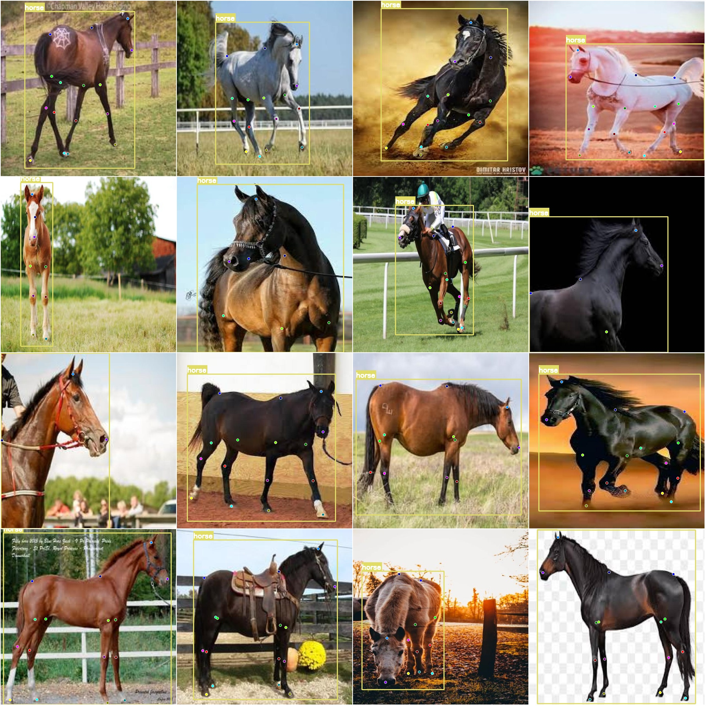

# Horse Keypoint Pose Estimation Detection Dataset COCO+YOLO Format: 400 Images in 1 Category, 16 Keypoints

Dataset format: YOLO keypoint format (Note that this is not the target detection or segmentation YOLO format, it only contains JPG images along with corresponding YOLO format TXT files)
Number of image files (JPG file count): 400
Number of annotations (TXT file count): 400
Training set size: 280
Validation set size: 80
Test set size: 40
Number of labeled categories: 1
Labeled category name: ['horse']
Keypoint names: ["tail","hip-left","hock-left","b-hoof-left","hock-right","b-hoof-right","whithers","shoulder-left","knee-left","f-hoof-left","knee-right","f-hoof-right","ears","nose","hip-right",
"shoulder-right"]
Number of keypoints labeled: 16
Each category has a number of boxes to be labeled:  
horse box count=400  
Total box count=400  
Image resolution: 640x640  
Important note: The dataset has been divided into training, validation, and test sets which can be directly used for training Yolov5-pose, Yolov8-pose, Yolov11-pose, or Yolov26-pose.
Special notice: This dataset does not guarantee the accuracy of the trained model or the weights file.
Image preview:  
Example of annotation:  
Annotation drawing result:

## Image

Here is a pay link on Stripe ( https://buy.stripe.com/3cs8yP7sY87d0vu9AB ). Please contact me lonlonago@foxmail.com after funding $89, and I will send you a complete data files , thank you!

